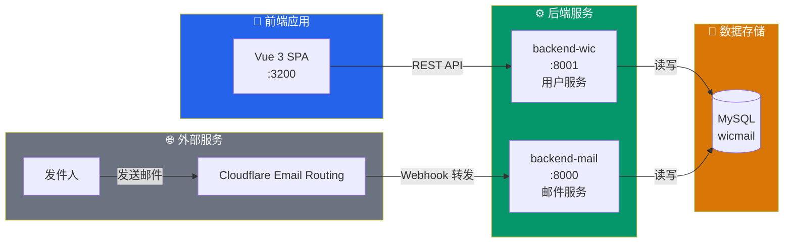
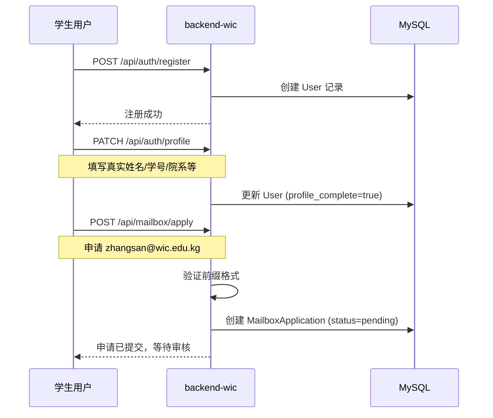
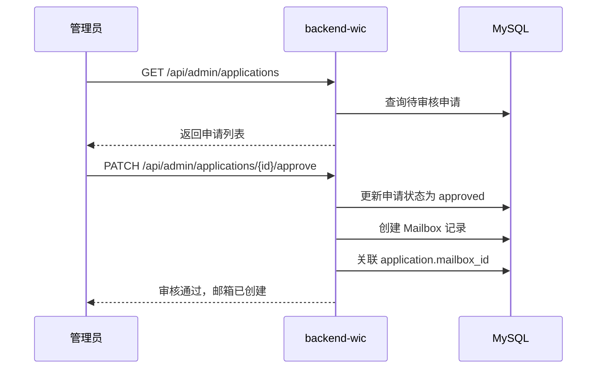
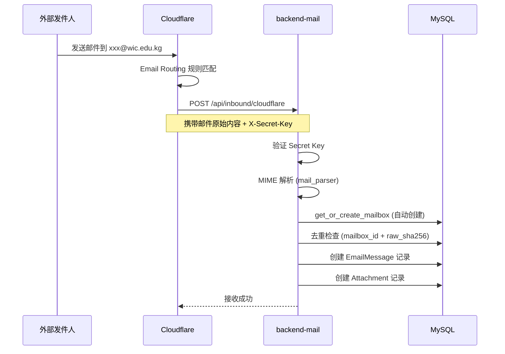
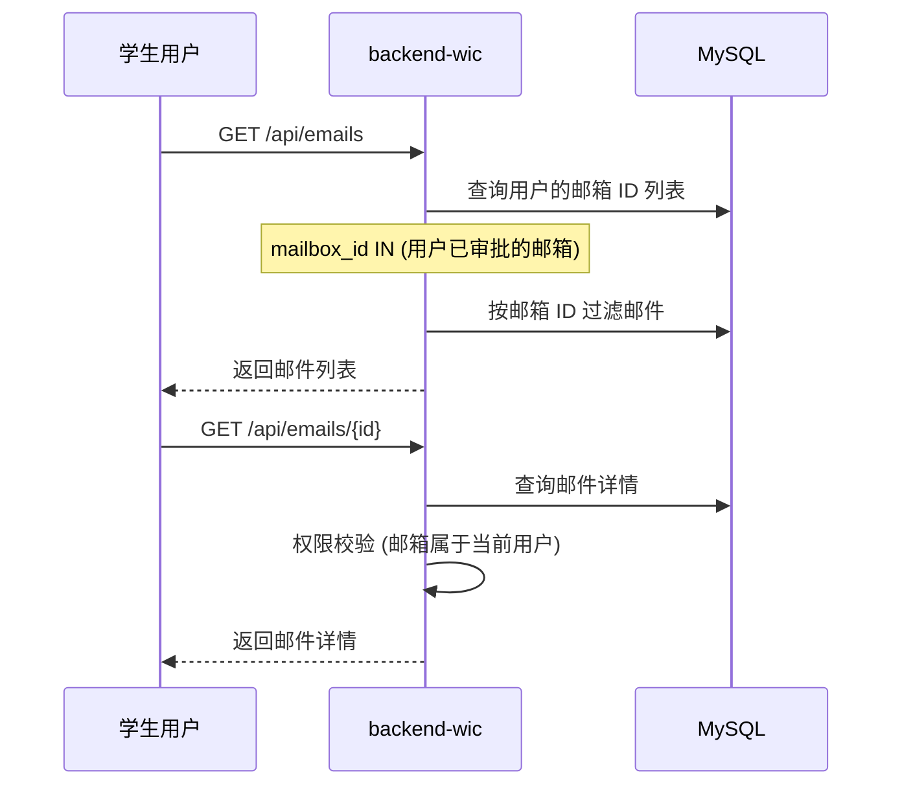

<p align="center">
  <a href="https://github.com/opxqo/wicmail">
    
  </a>
</p>

<h1 align="center">WicMail</h1>

<p align="center">
  <strong>校园邮箱申请与管理平台</strong>
</p>

<p align="center">
  <a href="https://github.com/opxqo/wicmail/blob/main/LICENSE">
    
  </a>
  <a href="https://github.com/opxqo/wicmail">
    
  </a>
  <a href="https://github.com/opxqo/wicmail">
    
  </a>
  <a href="https://github.com/opxqo/wicmail/stargazers">
    
  </a>
  <a href="https://github.com/opxqo/wicmail/network/members">
    
  </a>
</p>

<p align="center">
  为校园学生提供 <code>@wic.edu.kg</code> 邮箱申请与管理服务的全栈平台
</p>

---

## ✨ 核心特性

<table>
  <tr>
    <td width="50%" valign="top">
      <h3>🎓 学生端</h3>
      <ul>
        <li>注册账号并完善个人资料</li>
        <li>申请自定义前缀的校园邮箱</li>
        <li>查看申请审核状态</li>
        <li>接收和管理邮件</li>
        <li>修改密码和个人信息</li>
      </ul>
    </td>
    <td width="50%" valign="top">
      <h3>👨‍💼 管理端</h3>
      <ul>
        <li>审核邮箱申请（批准/拒绝）</li>
        <li>管理用户账号（启用/禁用）</li>
        <li>查看所有申请记录</li>
        <li>系统配置管理</li>
      </ul>
    </td>
  </tr>
</table>

## 🏗️ 系统架构



### 📦 架构特点

| 特性 | 说明 |
|:---|:---|
| **前后端分离** | 独立开发、部署，通过 REST API 通信 |
| **双后端架构** | `backend-wic` 负责用户服务，`backend-mail` 负责邮件服务 |
| **共享数据库** | 两个后端共享同一个 MySQL 数据库，通过表级别隔离职责 |
| **Cloudflare 集成** | 通过 Cloudflare Email Routing 自动接收外部邮件 |

## 🛠️ 技术栈

<div align="center">

### 前端


### 后端


</div>

## 📁 项目结构

```
wicmail/
├── backend-mail/              # 📧 邮件接收服务（端口 8000）
│   ├── app/
│   │   ├── main.py            # FastAPI 入口
│   │   ├── config.py          # 配置管理
│   │   ├── database.py        # 数据库连接
│   │   ├── models/            # 数据模型
│   │   ├── routers/           # API 路由
│   │   ├── schemas/           # Pydantic Schema
│   │   └── services/          # 业务逻辑
│   ├── alembic/               # 数据库迁移
│   └── requirements.txt       # Python 依赖
│
├── backend-wic/               # 👤 用户服务（端口 8001）
│   ├── app/
│   │   ├── main.py            # FastAPI 入口
│   │   ├── config.py          # 配置管理
│   │   ├── database.py        # 数据库连接
│   │   ├── models/            # 数据模型
│   │   ├── routers/           # API 路由
│   │   ├── schemas/           # Pydantic Schema
│   │   └── services/          # 业务逻辑
│   ├── alembic/               # 数据库迁移
│   └── requirements.txt       # Python 依赖
│
├── frontend/                  # 🖥️ Vue 3 前端应用（端口 3200）
│   ├── src/
│   │   ├── api/               # API 接口定义
│   │   ├── components/        # 公共组件
│   │   ├── composables/       # 组合式函数
│   │   ├── layouts/           # 布局组件
│   │   ├── router/            # 路由配置
│   │   ├── stores/            # Pinia 状态
│   │   ├── styles/            # 全局样式
│   │   └── views/             # 页面视图
│   └── package.json           # Node.js 依赖
│
├── design/                    # 🎨 设计资源
│   ├── avatars/               # 头像设计
│   └── logo/                  # Logo 资源
│
└── README.md                  # 📖 本文件
```

## 🚀 快速开始

### 📋 环境要求

| 组件 | 版本要求 |
|:---|:---|
| Python | 3.11+ |
| Node.js | 18+ |
| MySQL | 8.0+ |

### 1️⃣ 克隆项目

```bash
git clone https://github.com/opxqo/wicmail.git
cd wicmail
```

### 2️⃣ 启动后端服务

<details>
<summary><strong>📧 backend-mail（邮件服务）</strong></summary>

```bash
cd backend-mail

# 创建虚拟环境
python -m venv venv
source venv/bin/activate  # Windows: venv\Scripts\activate

# 安装依赖
pip install -r requirements.txt

# 配置环境变量
cp .env.example .env
# 编辑 .env 文件，配置数据库连接等

# 数据库迁移
alembic upgrade head

# 启动服务
uvicorn app.main:app --reload --port 8000
```

</details>

<details>
<summary><strong>👤 backend-wic（用户服务）</strong></summary>

```bash
cd backend-wic

# 创建虚拟环境
python -m venv venv
source venv/bin/activate

# 安装依赖
pip install -r requirements.txt

# 配置环境变量
cp .env.example .env
# 编辑 .env 文件，配置数据库连接、JWT Secret 等

# 数据库迁移
alembic upgrade head

# 启动服务
uvicorn app.main:app --reload --port 8001
```

</details>

### 3️⃣ 启动前端

```bash
cd frontend

# 安装依赖
npm install

# 配置环境变量
cp .env.example .env

# 启动开发服务器
npm run dev
```

### 4️⃣ 访问应用

- 前端：http://localhost:3200
- backend-wic API 文档：http://localhost:8001/docs
- backend-mail API 文档：http://localhost:8000/docs

## ⚙️ 环境变量配置

### backend-mail/.env

```env
# 数据库配置
DATABASE_URL=mysql+asyncmy://用户名:密码@your-database-host:3306/wicmail

# JWT 配置（两个后端需保持一致）
JWT_SECRET_KEY=your-secret-key-here

# Cloudflare 邮件验证密钥
CLOUDFLARE_EMAIL_SECRET_KEY=your-cloudflare-secret

# 默认管理员账号（首次启动自动创建）
DEFAULT_ADMIN_USERNAME=admin
DEFAULT_ADMIN_PASSWORD=admin123456
```

### backend-wic/.env

```env
# 数据库配置
DATABASE_URL=mysql+asyncmy://用户名:密码@your-database-host:3306/wicmail

# JWT 配置（两个后端需保持一致）
JWT_SECRET_KEY=your-secret-key-here

# 邮箱域名
MAILBOX_DOMAIN=wic.edu.kg
```

### frontend/.env

```env
# 后端 API 地址
VITE_PROXY_TARGET=http://localhost:8001

# Mock 模式（脱离后端开发）
VITE_USE_MOCK=false
```

## 📊 数据库设计

### ER 图

```mermaid
erDiagram
    users ||--o{ mailbox_applications : "提交申请"
    users ||--o{ mailbox_applications : "审核"
    mailbox_applications }o--|| mailboxes : "审核通过后关联"
    mailboxes ||--o{ email_messages : "接收邮件"
    email_messages ||--o{ attachments : "包含附件"

    users {
        int id PK
        string username UK
        string student_id UK
        string email UK
        string hashed_password
        string real_name
        string department
        string major
        string class_name
        string grade
        bool is_active
        bool is_admin
        datetime created_at
        datetime updated_at
    }

    mailboxes {
        int id PK
        string address UK
        string display_name
        bool is_active
        datetime created_at
    }

    email_messages {
        int id PK
        int mailbox_id FK
        string message_id
        string raw_sha256
        string envelope_from
        string subject
        text body_text
        text body_html
        string parse_status
        bool is_read
        datetime sent_at
        datetime received_at
    }

    attachments {
        int id PK
        int email_id FK
        string filename
        string content_type
        int size
        string storage_path
        bool is_inline
    }

    mailbox_applications {
        int id PK
        int user_id FK
        string requested_address UK
        string display_name
        string status
        string reason
        int reviewed_by FK
        string review_comment
        int mailbox_id FK
        datetime created_at
    }
```



### 表说明

| 表名 | 说明 | 主要字段 |
|:---|:---|:---|
| `users` | 用户账号表 | username, student_id, email, hashed_password, real_name, department, major |
| `mailboxes` | 邮箱地址表 | address (xxx@wic.edu.kg), display_name, is_active |
| `email_messages` | 邮件内容表 | mailbox_id, subject, body_text, body_html, envelope_from, is_read |
| `attachments` | 附件元数据表 | email_id, filename, content_type, size, storage_path |
| `mailbox_applications` | 邮箱申请表 | user_id, requested_address, status (pending/approved/rejected) |

## 📡 API 文档

### backend-wic（用户服务）

#### 认证接口

| 方法 | 路径 | 认证 | 说明 |
|:---|:---|:---|:---|
| `POST` | `/api/auth/register` | 无 | 用户注册 |
| `POST` | `/api/auth/login` | 无 | 用户登录，返回 JWT |
| `GET` | `/api/auth/me` | JWT | 获取当前用户信息 |
| `GET` | `/api/auth/profile` | JWT | 获取完整资料 |
| `PATCH` | `/api/auth/profile` | JWT | 更新个人资料 |
| `POST` | `/api/auth/change-password` | JWT | 修改密码 |

#### 邮箱接口

| 方法 | 路径 | 认证 | 说明 |
|:---|:---|:---|:---|
| `POST` | `/api/mailbox/apply` | JWT | 申请邮箱 |
| `GET` | `/api/mailbox/applications` | JWT | 我的申请记录 |
| `GET` | `/api/mailbox` | JWT | 我的已开通邮箱 |

#### 邮件接口

| 方法 | 路径 | 认证 | 说明 |
|:---|:---|:---|:---|
| `GET` | `/api/emails` | JWT | 获取我的邮件列表 |
| `GET` | `/api/emails/{id}` | JWT | 获取邮件详情 |
| `PATCH` | `/api/emails/{id}/read` | JWT | 标记已读 |
| `PATCH` | `/api/emails/{id}/unread` | JWT | 标记未读 |

#### 管理接口

| 方法 | 路径 | 认证 | 说明 |
|:---|:---|:---|:---|
| `GET` | `/api/admin/applications` | JWT+Admin | 获取所有申请 |
| `PATCH` | `/api/admin/applications/{id}/approve` | JWT+Admin | 批准申请 |
| `PATCH` | `/api/admin/applications/{id}/reject` | JWT+Admin | 拒绝申请 |
| `GET` | `/api/admin/users` | JWT+Admin | 获取用户列表 |
| `PATCH` | `/api/admin/users/{id}/toggle-active` | JWT+Admin | 启用/禁用用户 |

### backend-mail（邮件服务）

| 方法 | 路径 | 认证 | 说明 |
|:---|:---|:---|:---|
| `GET` | `/health` | 无 | 健康检查 |
| `POST` | `/api/auth/login` | 无 | 管理员登录 |
| `GET` | `/api/auth/me` | JWT | 当前用户信息 |
| `POST` | `/api/inbound/cloudflare` | X-Secret-Key | **接收 Cloudflare 转发邮件** |
| `GET` | `/api/emails` | JWT | 所有邮件列表 |
| `GET` | `/api/emails/{id}` | JWT | 邮件详情 |
| `PATCH` | `/api/emails/{id}/read` | JWT | 标记已读 |
| `PATCH` | `/api/emails/{id}/unread` | JWT | 标记未读 |

## 🔄 业务流程

### 📝 用户注册与邮箱申请



### ✅ 管理员审核



### 📬 邮件接收



### 📖 邮件查看



## 🚢 部署指南

### Docker 部署

```bash
# backend-mail
cd backend-mail
docker build -t wicmail-mail .
docker run -p 8000:8000 --env-file .env wicmail-mail

# backend-wic
cd backend-wic
docker build -t wicmail-wic .
docker run -p 8001:8001 --env-file .env wicmail-wic
```

### Zeabur 部署

项目已配置 Zeabur 部署文件（`Procfile`），可直接部署到 Zeabur 平台。

### 前端构建

```bash
cd frontend
npm run build  # 生成 dist 目录
```

构建产物可部署到任何静态文件服务器（Nginx、Vercel、Netlify 等）。

## 🧪 测试

```bash
# 后端测试（需要真实 MySQL）
cd backend-mail  # 或 backend-wic
pytest tests/ -v
```

## ❓ 常见问题

<details>
<summary><strong>Q: JWT Secret 需要一致吗？</strong></summary>

**A: 是的**。两个后端的 `.env` 中 `JWT_SECRET_KEY` 必须相同，否则认证体系无法互通。
</details>

<details>
<summary><strong>Q: 如何脱离后端开发前端？</strong></summary>

**A:** 在 `frontend/.env` 中设置 `VITE_USE_MOCK=true`，前端将使用内置的 Mock 数据。
</details>

<details>
<summary><strong>Q: 邮箱域名可以修改吗？</strong></summary>

**A:** 在 `backend-wic/.env` 中修改 `MAILBOX_DOMAIN` 配置项。
</details>

<details>
<summary><strong>Q: 如何配置 Cloudflare 邮件接收？</strong></summary>

**A:**
1. 在 Cloudflare 配置 Email Routing 规则
2. 设置转发到后端服务地址：`https://your-domain.com/api/inbound/cloudflare`
3. 在 `backend-mail/.env` 中配置 `CLOUDFLARE_EMAIL_SECRET_KEY`
</details>

## ⚠️ 已知问题

1. **邮箱创建竞态**：backend-mail 的 `get_or_create_mailbox` 可能与 backend-wic 的审批流程产生竞态
2. **JWT Secret 不一致**：两个后端默认使用不同的 Secret，需手动统一
3. **附件存储**：目前仅记录元数据，实际文件存储待实现

## 💡 改进建议

- [ ] 引入 API Gateway 统一入口
- [ ] 添加 WebSocket 实现邮件实时推送
- [ ] 实现邮件全文检索
- [ ] 集成对象存储服务存储附件
- [ ] 添加邮件转发功能

## 📄 开源协议

本项目采用 [MIT License](LICENSE) 开源协议。

## 🤝 贡献

欢迎提交 Issue 和 Pull Request！

1. Fork 本仓库
2. 创建你的特性分支 (`git checkout -b feature/AmazingFeature`)
3. 提交你的更改 (`git commit -m 'Add some AmazingFeature'`)
4. 推送到分支 (`git push origin feature/AmazingFeature`)
5. 打开一个 Pull Request

## 📞 联系方式

- **GitHub**: [opxqo/wicmail](https://github.com/opxqo/wicmail)
- **Issues**: [GitHub Issues](https://github.com/opxqo/wicmail/issues)

---

<p align="center">
  如果觉得有用，请给个 ⭐ 支持一下！
</p>
