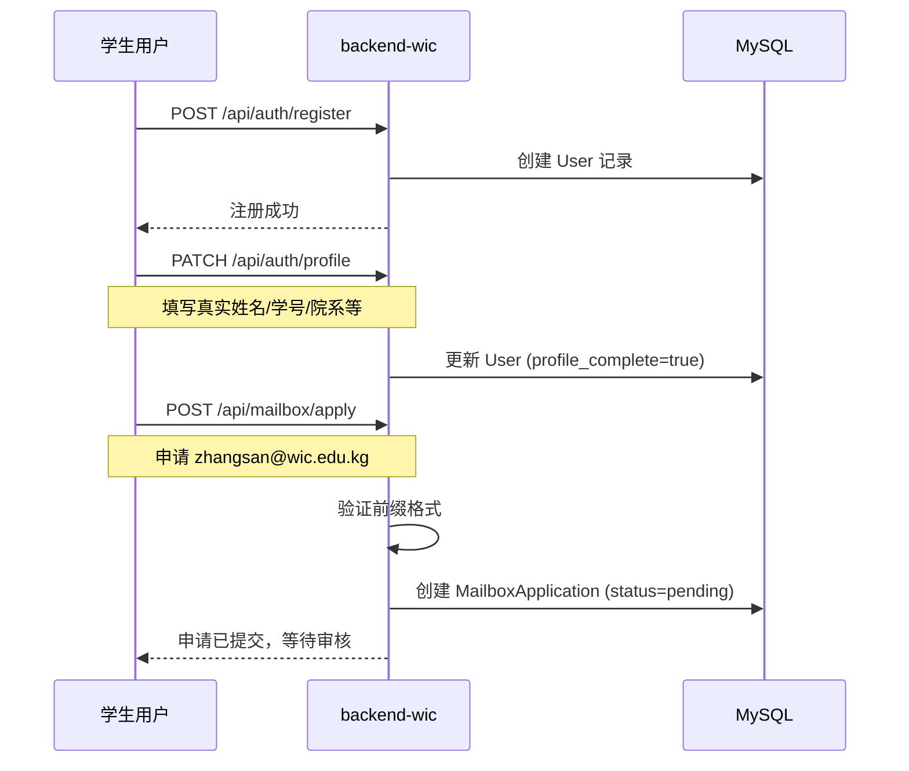
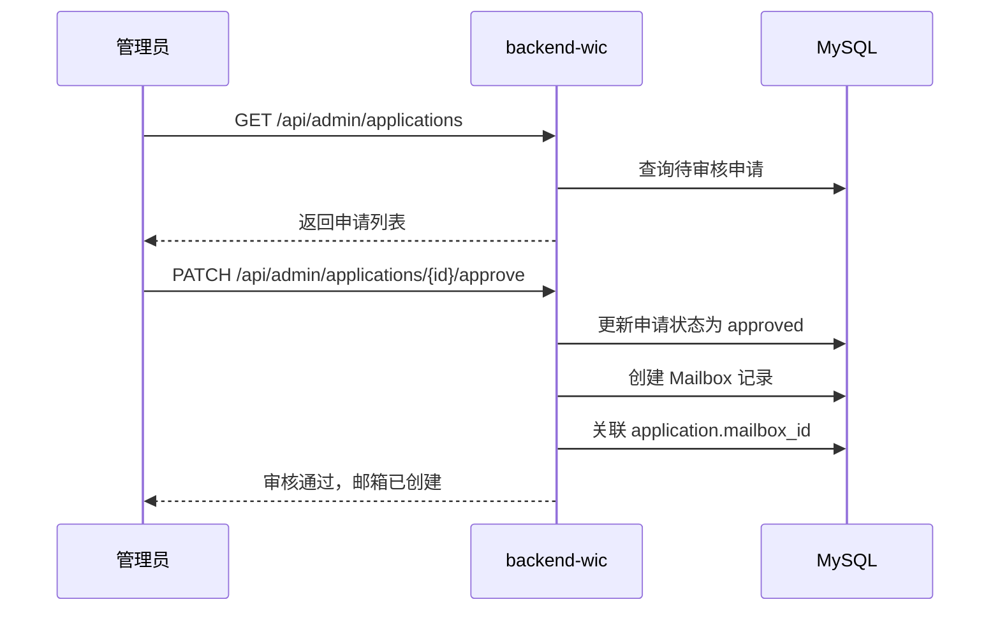
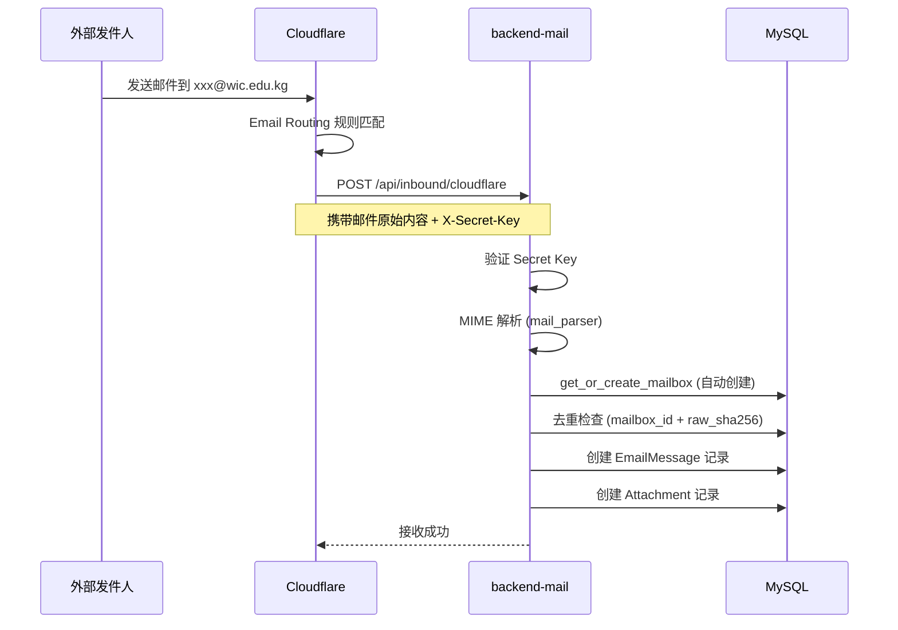
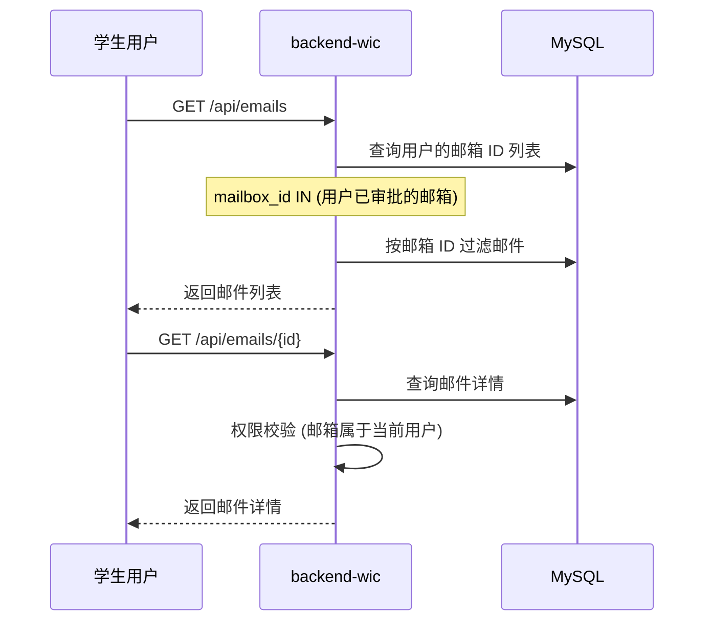

# WicMail 校园邮箱平台

> 为校园学生提供 `@wic.edu.kg` 邮箱申请与管理服务的全栈平台

## 项目简介

WicMail 是一个校园邮箱申请与管理平台，采用前后端分离 + 微服务架构。学生可以申请专属的校园邮箱（`{prefix}@wic.edu.kg`），管理员可以审核申请，系统自动接收和管理邮件。

### 核心功能

- **用户注册与认证**：学生注册账号，完善个人资料
- **邮箱申请**：申请自定义前缀的校园邮箱（如 `zhangsan@wic.edu.kg`）
- **管理审核**：管理员审核邮箱申请，批准或拒绝
- **邮件接收**：通过 Cloudflare Email Routing 自动接收邮件
- **邮件管理**：查看邮件列表、详情，标记已读/未读
- **个人中心**：修改密码、更新个人资料

## 系统架构

```
┌─────────────────────────────────────────────────────────────────────┐
│                         WicMail 系统架构                            │
├─────────────────────────────────────────────────────────────────────┤
│                                                                     │
│  ┌──────────────┐      ┌──────────────────┐      ┌──────────────┐  │
│  │   前端应用    │      │   后端服务集群    │      │   外部服务    │  │
│  │   Vue 3 SPA  │      │                  │      │              │  │
│  │   :3200      │      │  ┌────────────┐  │      │ Cloudflare   │  │
│  │              │──────│  │ backend-wic │  │      │ Email Routing│  │
│  │              │ API  │  │   :8001     │  │      │              │  │
│  │              │      │  └────────────┘  │      │              │  │
│  │              │      │                  │      │              │  │
│  │              │      │  ┌────────────┐  │      │              │  │
│  │              │      │  │backend-mail│←─│──────│──────────────│──│─
│  │              │      │  │   :8000    │  │ Webhook            │  │
│  └──────────────┘      │  └────────────┘  │      └──────────────┘  │
│                        │                  │                         │
│                        └────────┬─────────┘                         │
│                                 │                                   │
│                                 ▼                                   │
│                        ┌────────────────┐                           │
│                        │    MySQL DB     │                           │
│                        │    wicmail      │                           │
│                        │  175.178.102.49 │                           │
│                        └────────────────┘                           │
└─────────────────────────────────────────────────────────────────────┘
```

### 架构特点

- **前后端分离**：独立开发、部署，通过 REST API 通信
- **双后端架构**：
  - `backend-wic`：用户服务（注册/登录/邮箱申请/管理审核）
  - `backend-mail`：邮件服务（接收/解析/存储邮件）
- **共享数据库**：两个后端共享同一个 MySQL 数据库，通过表级别隔离职责
- **Cloudflare 集成**：通过 Cloudflare Email Routing 接收外部邮件

## 技术栈

### 前端

| 技术 | 版本 | 用途 |
|---|---|---|
| Vue | 3.5 | 核心框架 |
| Vite | 8.0 | 构建工具 |
| Naive UI | - | UI 组件库 |
| UnoCSS | - | 原子化 CSS 框架 |
| Pinia | 3.0 | 状态管理 |
| Vue Router | 5.0 | 路由管理 |
| Axios | 1.13 | HTTP 请求 |

### 后端

| 技术 | 版本 | 用途 |
|---|---|---|
| Python | 3.11+ | 编程语言 |
| FastAPI | - | Web 框架 |
| SQLAlchemy | - | ORM（asyncmy 异步驱动） |
| Alembic | - | 数据库迁移 |
| PyJWT | - | JWT 认证 |
| bcrypt | - | 密码加密 |

### 基础设施

| 服务 | 说明 |
|---|---|
| MySQL | 数据库 (`wicmail` @ `175.178.102.49:3306`) |
| Cloudflare | 域名解析、邮件路由 |
| Zeabur | 服务部署平台 |

## 项目结构

```
wicmail/
├── backend-mail/          # 邮件接收服务（端口 8000）
│   ├── app/
│   │   ├── main.py        # FastAPI 入口
│   │   ├── config.py      # 配置管理
│   │   ├── database.py    # 数据库连接
│   │   ├── models/        # 数据模型
│   │   ├── routers/       # API 路由
│   │   ├── schemas/       # Pydantic Schema
│   │   └── services/      # 业务逻辑
│   ├── alembic/           # 数据库迁移
│   ├── .env.example       # 环境变量模板
│   └── requirements.txt   # Python 依赖
│
├── backend-wic/           # 用户服务（端口 8001）
│   ├── app/
│   │   ├── main.py        # FastAPI 入口
│   │   ├── config.py      # 配置管理
│   │   ├── database.py    # 数据库连接
│   │   ├── models/        # 数据模型
│   │   ├── routers/       # API 路由
│   │   ├── schemas/       # Pydantic Schema
│   │   └── services/      # 业务逻辑
│   ├── alembic/           # 数据库迁移
│   ├── .env.example       # 环境变量模板
│   └── requirements.txt   # Python 依赖
│
├── frontend/              # Vue 3 前端应用（端口 3200）
│   ├── src/
│   │   ├── api/           # API 接口定义
│   │   ├── assets/        # 静态资源
│   │   ├── components/    # 公共组件
│   │   ├── composables/   # 组合式函数
│   │   ├── layouts/       # 布局组件
│   │   ├── router/        # 路由配置
│   │   ├── stores/        # Pinia 状态
│   │   ├── styles/        # 全局样式
│   │   ├── utils/         # 工具函数
│   │   └── views/         # 页面视图
│   ├── .env.example       # 环境变量模板
│   └── package.json       # Node.js 依赖
│
├── AGENTS.md              # AI 助手指引
├── CLAUDE.md              # 项目架构说明
└── README.md              # 本文件
```

## 快速开始

### 环境要求

- **后端**：Python 3.11+、MySQL 8.0+
- **前端**：Node.js 18+、npm/pnpm

### 1. 克隆项目

```bash
git clone https://github.com/opxqo/wicmail.git
cd wicmail
```

### 2. 后端部署

#### backend-mail（邮件服务）

```bash
cd backend-mail

# 创建虚拟环境
python -m venv venv
source venv/bin/activate  # Windows: venv\Scripts\activate

# 安装依赖
pip install -r requirements.txt

# 配置环境变量
cp .env.example .env
# 编辑 .env 文件，配置数据库连接等

# 数据库迁移
alembic upgrade head

# 启动服务（端口 8000）
uvicorn app.main:app --reload --port 8000
```

#### backend-wic（用户服务）

```bash
cd backend-wic

# 创建虚拟环境
python -m venv venv
source venv/bin/activate

# 安装依赖
pip install -r requirements.txt

# 配置环境变量
cp .env.example .env
# 编辑 .env 文件，配置数据库连接、JWT Secret 等

# 数据库迁移
alembic upgrade head

# 启动服务（端口 8001）
uvicorn app.main:app --reload --port 8001
```

### 3. 前端部署

```bash
cd frontend

# 安装依赖
npm install

# 配置环境变量
cp .env.example .env
# 编辑 .env 文件，配置后端 API 地址

# 启动开发服务器（端口 3200）
npm run dev
```

### 4. 环境变量配置

#### backend-mail/.env

```env
# 数据库配置
DATABASE_URL=mysql+asyncmy://用户名:密码@175.178.102.49:3306/wicmail

# JWT 配置（两个后端需保持一致）
JWT_SECRET_KEY=your-secret-key-here

# Cloudflare 邮件验证密钥
CLOUDFLARE_EMAIL_SECRET_KEY=your-cloudflare-secret

# 默认管理员账号（首次启动自动创建）
DEFAULT_ADMIN_USERNAME=admin
DEFAULT_ADMIN_PASSWORD=admin123456
```

#### backend-wic/.env

```env
# 数据库配置
DATABASE_URL=mysql+asyncmy://用户名:密码@175.178.102.49:3306/wicmail

# JWT 配置（两个后端需保持一致）
JWT_SECRET_KEY=your-secret-key-here

# 邮箱域名
MAILBOX_DOMAIN=wic.edu.kg
```

#### frontend/.env

```env
# 后端 API 地址
VITE_PROXY_TARGET=http://localhost:8001

# Mock 模式（脱离后端开发）
VITE_USE_MOCK=false
```

## 数据库设计

### ER 图

```mermaid
erDiagram
    users ||--o{ mailbox_applications : "提交申请"
    users ||--o{ mailbox_applications : "审核"
    mailbox_applications }o--|| mailboxes : "审核通过后关联"
    mailboxes ||--o{ email_messages : "接收邮件"
    email_messages ||--o{ attachments : "包含附件"

    users {
        int id PK
        string username UK
        string student_id UK
        string email UK
        string hashed_password
        string real_name
        string department
        string major
        string class_name
        string grade
        bool is_active
        bool is_admin
        datetime created_at
        datetime updated_at
    }

    mailboxes {
        int id PK
        string address UK
        string display_name
        bool is_active
        datetime created_at
    }

    email_messages {
        int id PK
        int mailbox_id FK
        string message_id
        string raw_sha256
        string envelope_from
        string subject
        text body_text
        text body_html
        string parse_status
        bool is_read
        datetime sent_at
        datetime received_at
    }

    attachments {
        int id PK
        int email_id FK
        string filename
        string content_type
        int size
        string storage_path
        bool is_inline
    }

    mailbox_applications {
        int id PK
        int user_id FK
        string requested_address UK
        string display_name
        string status
        string reason
        int reviewed_by FK
        string review_comment
        int mailbox_id FK
        datetime created_at
    }
```



### 表说明

| 表名 | 说明 | 主要字段 |
|---|---|---|
| `users` | 用户账号表 | username, student_id, email, hashed_password, real_name, department, major |
| `mailboxes` | 邮箱地址表 | address (xxx@wic.edu.kg), display_name, is_active |
| `email_messages` | 邮件内容表 | mailbox_id, subject, body_text, body_html, envelope_from, is_read |
| `attachments` | 附件元数据表 | email_id, filename, content_type, size, storage_path |
| `mailbox_applications` | 邮箱申请表 | user_id, requested_address, status (pending/approved/rejected) |

## API 文档

### backend-wic（用户服务）

#### 认证接口

| 方法 | 路径 | 认证 | 说明 |
|---|---|---|---|
| `POST` | `/api/auth/register` | 无 | 用户注册 |
| `POST` | `/api/auth/login` | 无 | 用户登录，返回 JWT |
| `GET` | `/api/auth/me` | JWT | 获取当前用户信息 |
| `GET` | `/api/auth/profile` | JWT | 获取完整资料 |
| `PATCH` | `/api/auth/profile` | JWT | 更新个人资料 |
| `POST` | `/api/auth/change-password` | JWT | 修改密码 |

#### 邮箱接口

| 方法 | 路径 | 认证 | 说明 |
|---|---|---|---|
| `POST` | `/api/mailbox/apply` | JWT | 申请邮箱 |
| `GET` | `/api/mailbox/applications` | JWT | 我的申请记录 |
| `GET` | `/api/mailbox` | JWT | 我的已开通邮箱 |

#### 邮件接口

| 方法 | 路径 | 认证 | 说明 |
|---|---|---|---|
| `GET` | `/api/emails` | JWT | 获取我的邮件列表 |
| `GET` | `/api/emails/{id}` | JWT | 获取邮件详情 |
| `PATCH` | `/api/emails/{id}/read` | JWT | 标记已读 |
| `PATCH` | `/api/emails/{id}/unread` | JWT | 标记未读 |

#### 管理接口

| 方法 | 路径 | 认证 | 说明 |
|---|---|---|---|
| `GET` | `/api/admin/applications` | JWT+Admin | 获取所有申请 |
| `PATCH` | `/api/admin/applications/{id}/approve` | JWT+Admin | 批准申请 |
| `PATCH` | `/api/admin/applications/{id}/reject` | JWT+Admin | 拒绝申请 |
| `GET` | `/api/admin/users` | JWT+Admin | 获取用户列表 |
| `PATCH` | `/api/admin/users/{id}/toggle-active` | JWT+Admin | 启用/禁用用户 |

### backend-mail（邮件服务）

| 方法 | 路径 | 认证 | 说明 |
|---|---|---|---|
| `GET` | `/health` | 无 | 健康检查 |
| `POST` | `/api/auth/login` | 无 | 管理员登录 |
| `GET` | `/api/auth/me` | JWT | 当前用户信息 |
| `POST` | `/api/inbound/cloudflare` | X-Secret-Key | **接收 Cloudflare 转发邮件** |
| `GET` | `/api/emails` | JWT | 所有邮件列表 |
| `GET` | `/api/emails/{id}` | JWT | 邮件详情 |
| `PATCH` | `/api/emails/{id}/read` | JWT | 标记已读 |
| `PATCH` | `/api/emails/{id}/unread` | JWT | 标记未读 |

## 业务流程

### 1. 用户注册与邮箱申请



### 2. 管理员审核



### 3. 邮件接收



### 4. 邮件查看



## 部署指南

### Docker 部署

两个后端均提供 Dockerfile，可使用 Docker 部署：

```bash
# backend-mail
cd backend-mail
docker build -t wicmail-mail .
docker run -p 8000:8000 --env-file .env wicmail-mail

# backend-wic
cd backend-wic
docker build -t wicmail-wic .
docker run -p 8001:8001 --env-file .env wicmail-wic
```

### Zeabur 部署

项目已配置 Zeabur 部署文件（`Procfile`），可直接部署到 Zeabur 平台。

### 前端构建

```bash
cd frontend
npm run build  # 生成 dist 目录
```

构建产物可部署到任何静态文件服务器（Nginx、Vercel、Netlify 等）。

## 开发指南

### 代码规范

- 所有代码注释、提交信息使用 **中文**
- 前端使用 ESLint（@antfu/eslint-config）
- Git 提交通过 `simple-git-hooks + lint-staged` 自动格式化

### 测试

```bash
# 后端测试（需要真实 MySQL）
cd backend-mail  # 或 backend-wic
pytest tests/ -v

# 前端暂无测试配置
```

### 常见问题

#### Q: JWT Secret 需要一致吗？

**A: 是的**。两个后端的 `.env` 中 `JWT_SECRET_KEY` 必须相同，否则认证体系无法互通。

#### Q: 如何脱离后端开发前端？

**A:** 在 `frontend/.env` 中设置 `VITE_USE_MOCK=true`，前端将使用内置的 Mock 数据。

#### Q: 邮箱域名可以修改吗？

**A:** 在 `backend-wic/.env` 中修改 `MAILBOX_DOMAIN` 配置项。

#### Q: 如何配置 Cloudflare 邮件接收？

**A:**
1. 在 Cloudflare 配置 Email Routing 规则
2. 设置转发到后端服务地址：`https://your-domain.com/api/inbound/cloudflare`
3. 在 `backend-mail/.env` 中配置 `CLOUDFLARE_EMAIL_SECRET_KEY`

## 已知问题

1. **邮箱创建竞态**：backend-mail 的 `get_or_create_mailbox` 可能与 backend-wic 的审批流程产生竞态
2. **JWT Secret 不一致**：两个后端默认使用不同的 Secret，需手动统一
3. **附件存储**：目前仅记录元数据，实际文件存储待实现

## 改进建议

- 引入 API Gateway 统一入口
- 添加 WebSocket 实现邮件实时推送
- 实现邮件全文检索
- 集成对象存储服务存储附件
- 添加邮件转发功能

## 开源协议

MIT License

## 联系方式

- GitHub: [opxqo/wicmail](https://github.com/opxqo/wicmail)
- 问题反馈：[Issues](https://github.com/opxqo/wicmail/issues)
