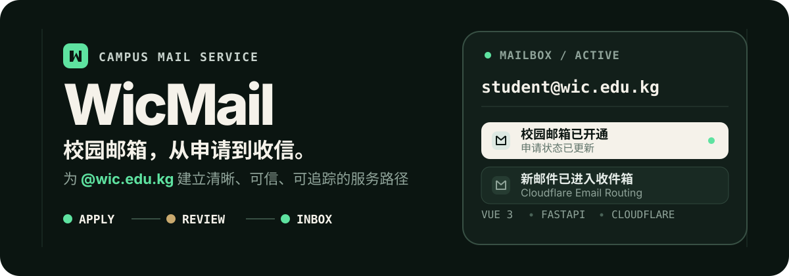
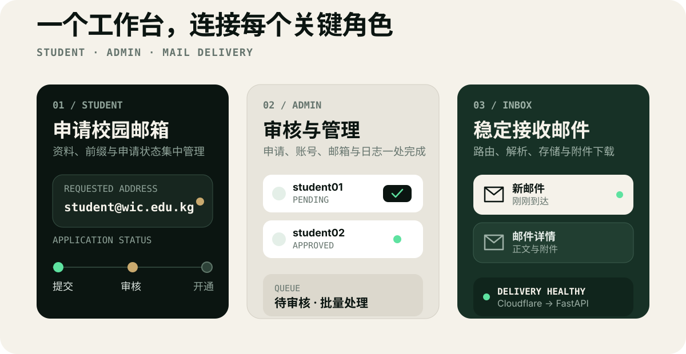
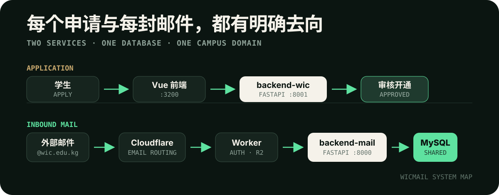
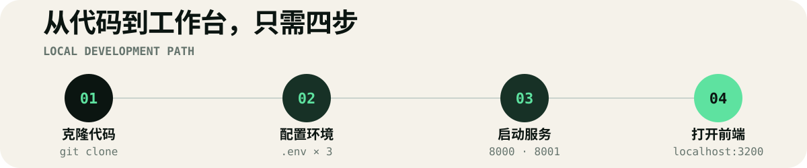

# WicMail

<p align="center">
  
</p>

<p align="center">
  <strong>校园邮箱申请与管理平台</strong><br>
  学生申请 <code>@wic.edu.kg</code>，管理员在线审核，Cloudflare 路由邮件进入统一收件箱。
</p>

<p align="center">
  <a href="#快速开始">快速开始</a>&nbsp;&nbsp;·&nbsp;&nbsp;
  <a href="./API_DOC.md">API 文档</a>&nbsp;&nbsp;·&nbsp;&nbsp;
  <a href="./wicmail_architecture_analysis.md">架构说明</a>&nbsp;&nbsp;·&nbsp;&nbsp;
  <a href="https://github.com/opxqo/wicmail/issues">Issues</a>
</p>

## 产品能力

<p align="center">
  
</p>

## 系统链路

<p align="center">
  
</p>

`frontend` 连接用户服务，Cloudflare Worker 连接邮件服务；两个 FastAPI 服务共享 MySQL，职责保持独立。

## 快速开始

<p align="center">
  
</p>

环境要求：Python `3.11+`、Node.js `18+`、MySQL `8.0+`。

<details open>
<summary><strong>1. 克隆并配置</strong></summary>

```bash
git clone https://github.com/opxqo/wicmail.git
cd wicmail

cp backend-wic/.env.example backend-wic/.env
cp backend-mail/.env.example backend-mail/.env
cp frontend/.env.example frontend/.env
```

两个后端填写同一个 `DATABASE_URL` 和 `JWT_SECRET_KEY`。

联调本地后端时，在 `frontend/.env` 中使用：

```env
VITE_AXIOS_BASE_URL=http://localhost:8001
VITE_USE_MOCK=false
```

</details>

<details>
<summary><strong>2. 启动 backend-wic · 端口 8001</strong></summary>

```bash
cd backend-wic
python -m venv .venv
source .venv/bin/activate
pip install -r requirements.txt
alembic upgrade head
uvicorn app.main:app --reload --port 8001
```

</details>

<details>
<summary><strong>3. 启动 backend-mail · 端口 8000</strong></summary>

```bash
cd backend-mail
python -m venv .venv
source .venv/bin/activate
pip install -r requirements.txt
alembic upgrade head
uvicorn app.main:app --reload --port 8000
```

</details>

<details>
<summary><strong>4. 启动 frontend · 端口 3200</strong></summary>

```bash
cd frontend
npm install
npm run dev
```

打开 <http://localhost:3200>。仅开发前端时，将 `VITE_USE_MOCK=true`。

</details>

## Cloudflare 收信

```text
Email Routing → Email Worker → backend-mail → MySQL → WicMail 收件箱
```

Worker 的 `SECRET_KEY` 必须与后端的 `CLOUDFLARE_EMAIL_SECRET_KEY` 一致；附件上传需要绑定 R2 bucket `ATTACHMENTS`。

```bash
cd worker
npm install
npx wrangler deploy
```

## 项目组成

| 目录 | 技术 | 职责 |
| --- | --- | --- |
| `frontend/` | Vue 3 · Vite · Naive UI · UnoCSS | 学生与管理员工作台 |
| `backend-wic/` | FastAPI · SQLAlchemy | 用户、申请、审核与邮件查看 |
| `backend-mail/` | FastAPI · SQLAlchemy | 入站邮件解析与保存 |
| `worker/` | Cloudflare Email Worker · R2 | 邮件转发与附件上传 |

<details>
<summary><strong>部署前检查</strong></summary>

- 替换示例数据库密码、JWT 密钥与默认管理员密码，不要提交 `.env`。
- 确认两个后端连接同一数据库，并分别完成 Alembic 迁移。
- 后端测试依赖真实 MySQL；分别在两个后端目录运行 `pytest tests/ -v`。
- 当前仓库根目录未提供许可证文件。

</details>

## 文档

[API 文档](./API_DOC.md) · [架构分析](./wicmail_architecture_analysis.md) · [前端说明](./frontend/README.md) · [参与讨论](https://github.com/opxqo/wicmail/issues)
