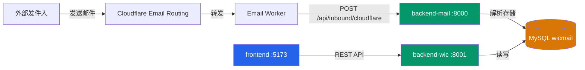
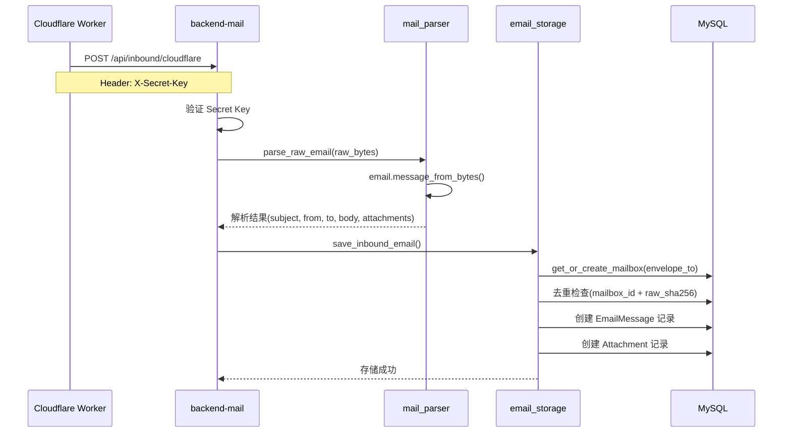
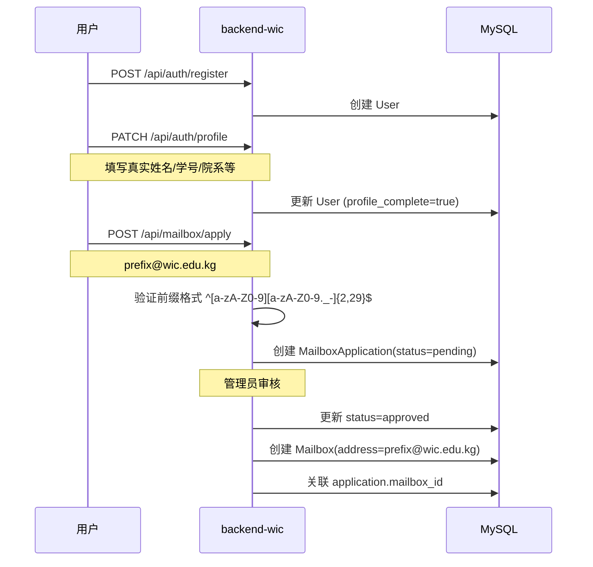
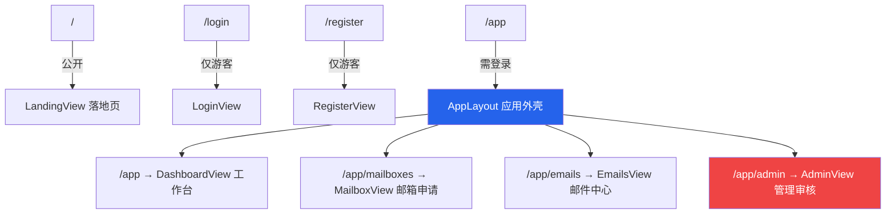
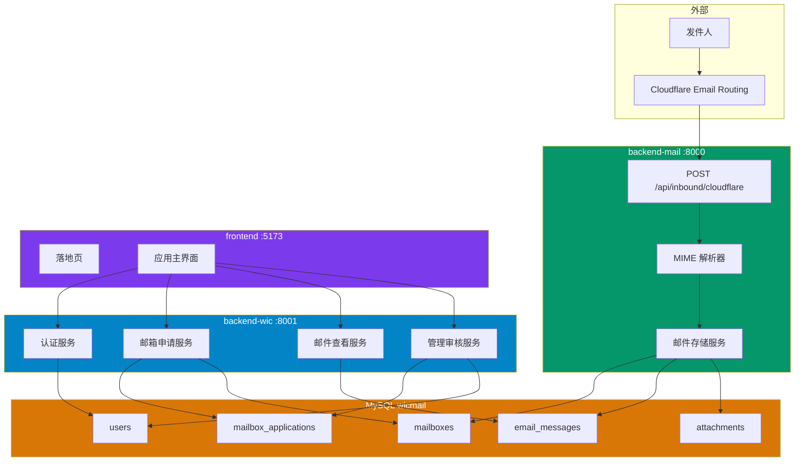

# WicMail 项目架构分析

## 项目概述

WicMail 是一个**校园邮箱申请与管理平台**，采用前后端分离 + 微服务架构，由三个模块组成：

| 模块 | 技术栈 | 端口 | 职责 |
|---|---|---|---|
| **backend-mail** | FastAPI + SQLAlchemy | 8000 | 邮件接收与解析（接收 Cloudflare Email Worker 转发的邮件） |
| **backend-wic** | FastAPI + SQLAlchemy | 8001 | 用户服务（注册/登录/邮箱申请/邮件查看/管理审核） |
| **frontend** | Vue 3 + Vite + Element Plus | 5173 | Web 前端 SPA |

> [!IMPORTANT]
> 两个后端**共享同一个 MySQL 数据库** (`wicmail` @ `175.178.102.49:3306`)，使用相同的表结构。

## 系统架构图



---

## 数据库模型 (5张表)

```mermaid
erDiagram
    users ||--o{ mailbox_applications : "提交申请"
    users ||--o{ mailbox_applications : "审核"
    mailbox_applications }o--|| mailboxes : "审核通过后关联"
    mailboxes ||--o{ email_messages : "接收邮件"
    email_messages ||--o{ attachments : "包含附件"

    users {
        int id PK
        string username UK
        string student_id UK
        string email UK
        string hashed_password
        string real_name
        string department
        string major
        string class_name
        string grade
        bool is_active
        bool is_admin
        datetime created_at
        datetime updated_at
    }

    mailboxes {
        int id PK
        string address UK
        string display_name
        bool is_active
        datetime created_at
    }

    email_messages {
        int id PK
        int mailbox_id FK
        string message_id
        string raw_sha256
        string envelope_from
        string subject
        text body_text
        text body_html
        string parse_status
        bool is_read
        datetime sent_at
        datetime received_at
    }

    attachments {
        int id PK
        int email_id FK
        string filename
        string content_type
        int size
        string storage_path
        bool is_inline
    }

    mailbox_applications {
        int id PK
        int user_id FK
        string requested_address UK
        string display_name
        string status
        string reason
        int reviewed_by FK
        string review_comment
        int mailbox_id FK
        datetime created_at
    }
```



> [!NOTE]
> `mailbox_applications` 表仅由 **backend-wic** 定义和使用，其余 4 张表由两个后端共享。

---

## 模块一：backend-mail（邮件接收服务）

### 文件结构

```
backend-mail/
├── app/
│   ├── main.py              # FastAPI 入口，启动时创表+初始化管理员
│   ├── config.py             # Pydantic Settings 配置
│   ├── database.py           # SQLAlchemy async 引擎 & Session
│   ├── models/
│   │   ├── email.py          # EmailMessage, Mailbox, Attachment 模型
│   │   └── user.py           # User 模型 (bcrypt 密码)
│   ├── routers/
│   │   ├── auth.py           # 登录 & 当前用户
│   │   ├── emails.py         # 邮件列表/详情/已读标记
│   │   └── inbound.py        # Cloudflare Worker 接收入口
│   ├── schemas/
│   │   ├── email.py          # 邮件响应 Schema
│   │   └── inbound.py        # 接收请求 Schema
│   └── services/
│       ├── auth.py           # JWT 认证依赖
│       ├── jwt_utils.py      # JWT 工具
│       ├── email_storage.py  # 邮件存储 (去重+入库)
│       └── mail_parser.py    # MIME 邮件解析
├── email_service.py          # 发送邮件 (阿里云企业邮SMTP)
├── alembic/                  # 数据库迁移
├── .env                      # 配置
└── requirements.txt
```

### API 端点

| 方法 | 路径 | 认证 | 说明 |
|---|---|---|---|
| `GET` | `/health` | 无 | 健康检查 |
| `POST` | `/api/auth/login` | 无 | 管理员登录 → JWT |
| `GET` | `/api/auth/me` | JWT | 当前用户信息 |
| `POST` | `/api/inbound/cloudflare` | X-Secret-Key | **核心：接收 Cloudflare 转发的邮件** |
| `GET` | `/api/emails` | JWT | 所有邮件分页列表 |
| `GET` | `/api/emails/{id}` | JWT | 邮件详情 |
| `PATCH` | `/api/emails/{id}/read` | JWT | 标记已读 |
| `PATCH` | `/api/emails/{id}/unread` | JWT | 标记未读 |

### 核心流程：邮件接收



---

## 模块二：backend-wic（用户服务）

### 文件结构

```
backend-wic/
├── app/
│   ├── main.py              # FastAPI 入口
│   ├── config.py             # 配置
│   ├── database.py           # 数据库连接
│   ├── models/
│   │   ├── user.py           # User + profile_complete 逻辑
│   │   ├── mailbox.py        # Mailbox + MailboxApplication
│   │   └── email.py          # EmailMessage + Attachment
│   ├── routers/
│   │   ├── auth.py           # 注册/登录/个人资料
│   │   ├── mailbox.py        # 邮箱申请/我的邮箱
│   │   ├── emails.py         # 我的邮件(权限过滤)
│   │   └── admin.py          # 管理审核/用户管理
│   ├── schemas/
│   │   ├── auth.py           # 认证相关 Schema
│   │   ├── email.py          # 邮件 Schema
│   │   └── mailbox.py        # 邮箱 Schema
│   └── services/
│       ├── auth.py           # JWT 认证 + 管理员权限检查
│       └── jwt_utils.py      # JWT 工具
├── alembic/                  # 数据库迁移
├── .env
└── requirements.txt
```

### API 端点

| 方法 | 路径 | 认证 | 说明 |
|---|---|---|---|
| **认证** | | | |
| `POST` | `/api/auth/register` | 无 | 用户注册 |
| `POST` | `/api/auth/login` | 无 | 用户登录 → JWT |
| `GET` | `/api/auth/me` | JWT | 基本信息 |
| `GET` | `/api/auth/profile` | JWT | 完整资料 + 完善度检查 |
| `PATCH` | `/api/auth/profile` | JWT | 更新资料 |
| **邮箱** | | | |
| `POST` | `/api/mailbox/apply` | JWT | 申请邮箱（需资料完善） |
| `GET` | `/api/mailbox/applications` | JWT | 我的申请记录 |
| `GET` | `/api/mailbox` | JWT | 我的已开通邮箱 |
| **邮件** | | | |
| `GET` | `/api/emails` | JWT | 我的邮件（按邮箱过滤） |
| `GET` | `/api/emails/{id}` | JWT | 邮件详情（权限校验） |
| `PATCH` | `/api/emails/{id}/read` | JWT | 标记已读 |
| `PATCH` | `/api/emails/{id}/unread` | JWT | 标记未读 |
| **管理** | | | |
| `GET` | `/api/admin/applications` | JWT+Admin | 所有申请（可按状态过滤） |
| `PATCH` | `/api/admin/applications/{id}/approve` | JWT+Admin | 批准申请 → 创建邮箱 |
| `PATCH` | `/api/admin/applications/{id}/reject` | JWT+Admin | 拒绝申请 |
| `GET` | `/api/admin/users` | JWT+Admin | 用户列表 |
| `PATCH` | `/api/admin/users/{id}/toggle-active` | JWT+Admin | 启用/禁用用户 |

### 核心流程：邮箱申请



### 邮件访问控制

用户只能查看**自己已审批通过的邮箱**中的邮件：

```python
# 获取用户的邮箱 ID 列表
user_mailbox_ids = SELECT mailbox_id FROM mailbox_applications 
                   WHERE user_id = current_user.id AND status = 'approved'

# 按邮箱 ID 过滤邮件
emails = SELECT * FROM email_messages 
         WHERE mailbox_id IN (user_mailbox_ids)
```

---

## 模块三：frontend（前端）

### 技术栈

| 技术 | 版本 | 用途 |
|---|---|---|
| Vue | 3.5 | 核心框架 |
| Vite | 7.2 | 构建工具 |
| Vue Router | 4.6 | 路由 |
| Pinia | 3.0 | 状态管理 |
| Element Plus | 2.11 | UI 组件库 |
| Axios | 1.13 | HTTP 请求 |

### 文件结构

```
frontend/src/
├── main.js               # 入口：注册 Vue/Router/Pinia/ElementPlus
├── App.vue               # 根组件 (<router-view/>)
├── router/
│   └── index.js          # 路由配置 + 导航守卫
├── stores/
│   └── auth.js           # Pinia 认证状态 (token/user/login/logout)
├── services/
│   ├── http.js           # Axios 封装 + API 方法映射
│   └── mock.js           # 完整的 Mock 数据后端
├── layouts/
│   └── AppLayout.vue     # 应用外壳 (侧边栏+顶栏)
├── views/
│   ├── LandingView.vue   # 落地页 (Hero+流程+特性+数据)
│   ├── LoginView.vue     # 登录页
│   ├── RegisterView.vue  # 注册页
│   ├── DashboardView.vue # 工作台 (统计+邮箱+最近邮件)
│   ├── MailboxView.vue   # 邮箱申请 (申请表单+申请历史)
│   ├── EmailsView.vue    # 邮件中心 (列表+抽屉详情)
│   └── AdminView.vue     # 管理审核 (申请审批+用户管理)
└── styles/
    └── global.css        # 全局样式 (1749行，完整设计系统)
```

### 路由结构



### 状态管理 (Pinia auth store)

```
localStorage('wicmail_token') ←→ auth.token
                                   auth.user
                                   auth.isAuthenticated (computed)
                                   auth.isAdmin (computed)
```

### HTTP 服务层

- 基于 Axios，baseURL 从 `VITE_API_BASE_URL` 读取
- 请求拦截器：自动附加 `Authorization: Bearer {token}`
- 响应拦截器：提取 `.data`，错误弹出 `ElMessage.error`
- **Mock 模式**：当 API URL 未配置时，使用内存 Mock 数据（含 240ms 延迟）

---

## 模块间交互总结

### 数据流



### 关键设计决策

| 决策 | 说明 |
|---|---|
| **共享数据库** | 两个后端直连同一 MySQL，通过表级别隔离职责 |
| **邮箱自动创建** | backend-mail 收到邮件时会 `get_or_create_mailbox`，即使用户未申请 |
| **权限隔离** | backend-wic 的用户只能看到自己已审批邮箱的邮件 |
| **Mock 模式** | 前端可脱离后端独立开发，内置完整 Mock 数据 |
| **邮件域名** | `wic.edu.kg`，邮箱格式 `{prefix}@wic.edu.kg` |

---

## 潜在问题 & 改进建议

> [!WARNING]
> **JWT Secret 不一致**：backend-mail 和 backend-wic 使用**不同的 JWT Secret Key**，这意味着两个服务的认证体系完全独立。如果未来需要跨服务访问，需统一 Secret。

> [!WARNING]
> **默认管理员密码**：backend-mail 启动时自动创建 `admin/admin123456` 管理员账户，生产环境需修改。

> [!NOTE]
> **邮箱创建冲突风险**：backend-mail 的 `get_or_create_mailbox` 和 backend-wic 的 `approve → create mailbox` 都可能创建 `mailboxes` 记录。如果邮件在审批前到达，可能导致邮箱记录已存在但未与用户关联。

> [!TIP]
> **可优化方向**：
> - 考虑引入 API Gateway 统一入口
> - 增加 WebSocket 实现邮件实时推送
> - 添加邮件搜索功能（全文检索）
> - 附件存储目前仅记录元数据，需实现实际文件存储（对象存储）
